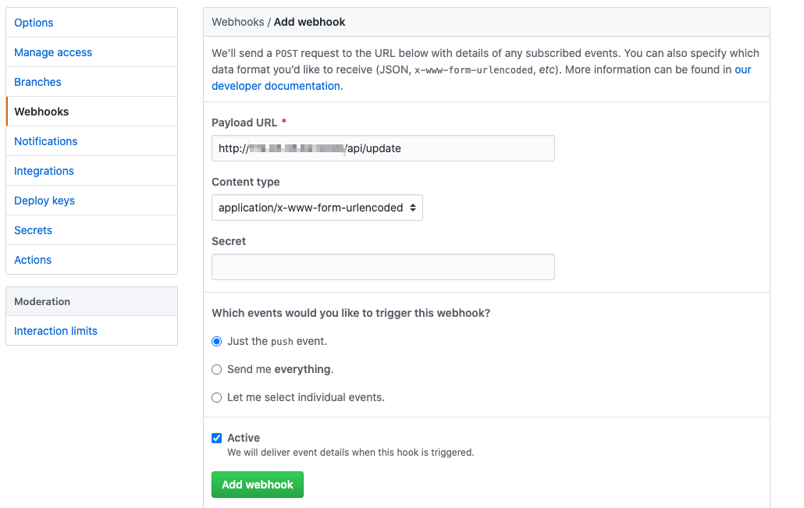
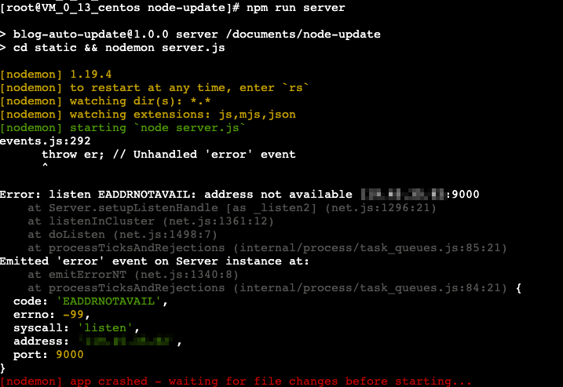

# AutoUpdateServer-Node.js

> 这是一个**简单的`post`服务**，可部署于服务器/云服务器，用于执行**自动化部署**。主要利用`GitHub Webhooks`。

## GitHub Webhooks

利用`GitHub Webhooks`来执行自动化部署。



在仓库的`Settings -> Webhooks`中设置了请求地址后，该仓库的每次`push`操作（当然具体的操作类型可选择）结束后`GitHub`会向设置的地址发送一个`post`请求，请求中**包括本次操作的仓库、更新的文件**等等。

这个`post`请求相当于一个**通知**，我们收到`post`请求后可以对**服务器端的本地仓库进行更新**，拉取·个
GitHub上的最新代码，从而实现**一次提交，服务器端自动化部署**。

## 使用

### 1.设置`config.js`

```js
...
module.exports = {
  HOST: "127.0.0.1",// 云服务器要填写该服务器的内网IP
  PORT: 9000,
  logger: logger// 日志
};
...
```

在`config.js`中设置该服务的IP和端口，`SERVER`为服务的IP，`PORT`填写服务的端口。

**注意项：**

> * 需要**确保填写的端口正确开通并暴露在公网**，需设置防火墙（Windows）或安全组（云服务器）；
> * 云服务器的话`SERVER`需要填写服务器的内网地址，填写公网地址可能会报以下错误。


### 2.设置`server.js`

这里需要配置服务器上的**本地仓库的绝对地址**。

```js
...
const repoName = JSON.parse(request.body.payload).repository.name
const cmd = `/documents/GitHub/${repoName}`;// 本地仓库地址
...
```

### 3.开发环境部署

进入文件夹根目录：

```shell
npm install # 安装依赖
npm run server # 启动服务
```

### 4.服务器端常驻

安装`pm2`并运行`server.js`:

```sh
npm install pm2 -g
# 进入static文件夹
pm2 start server.js
```
